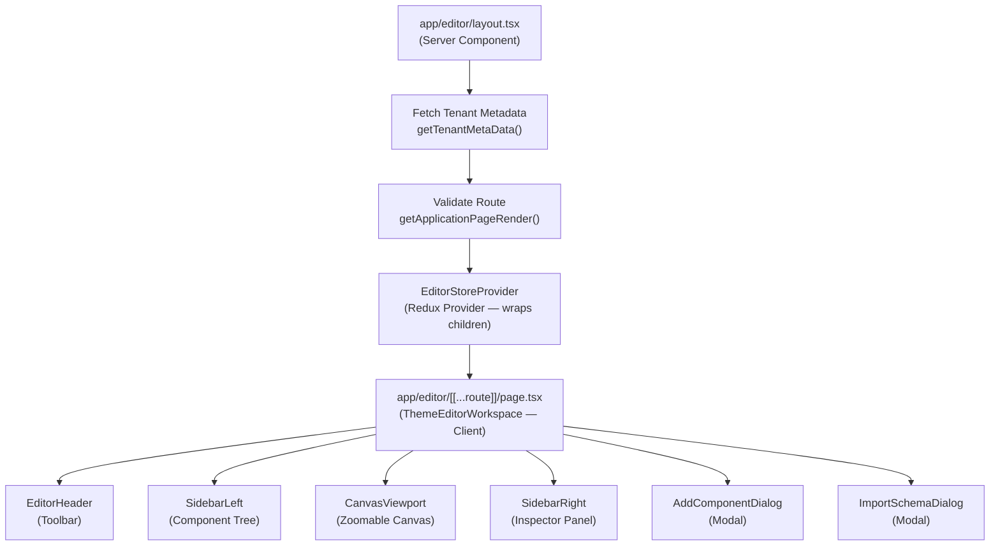
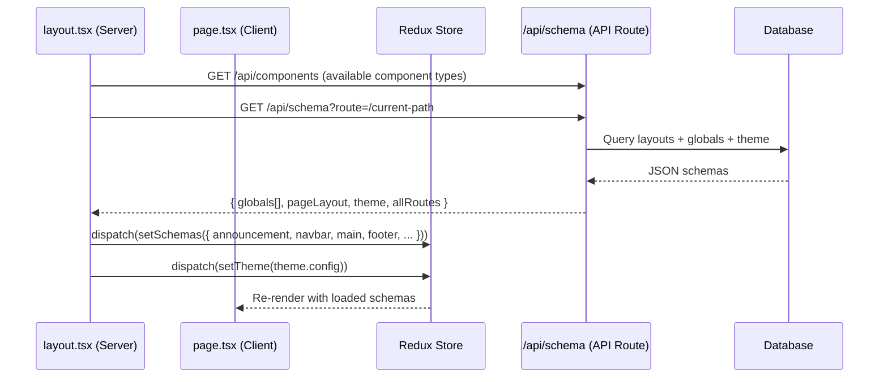
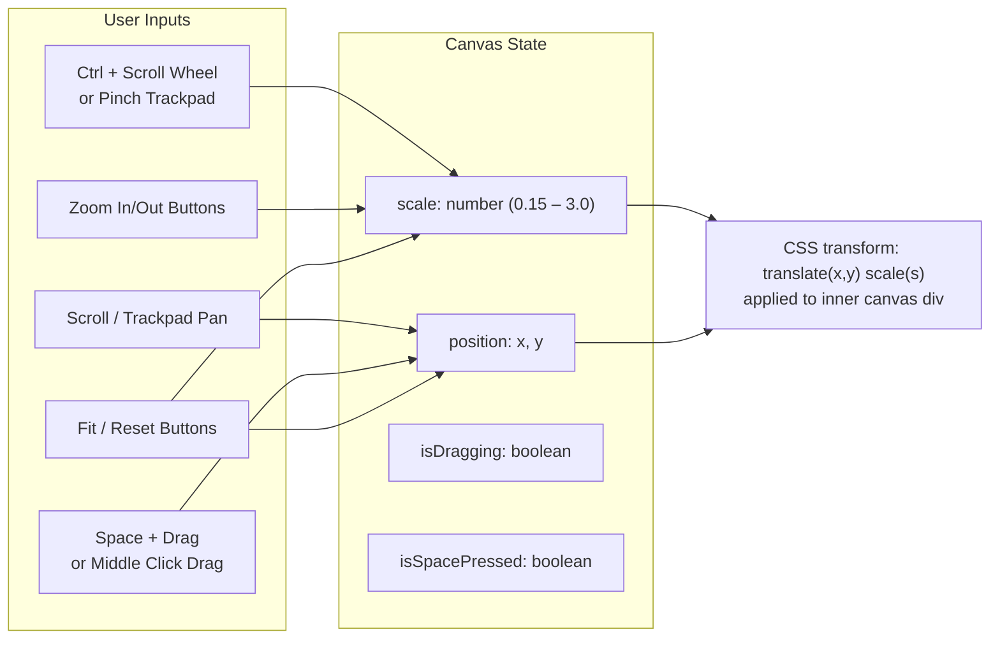
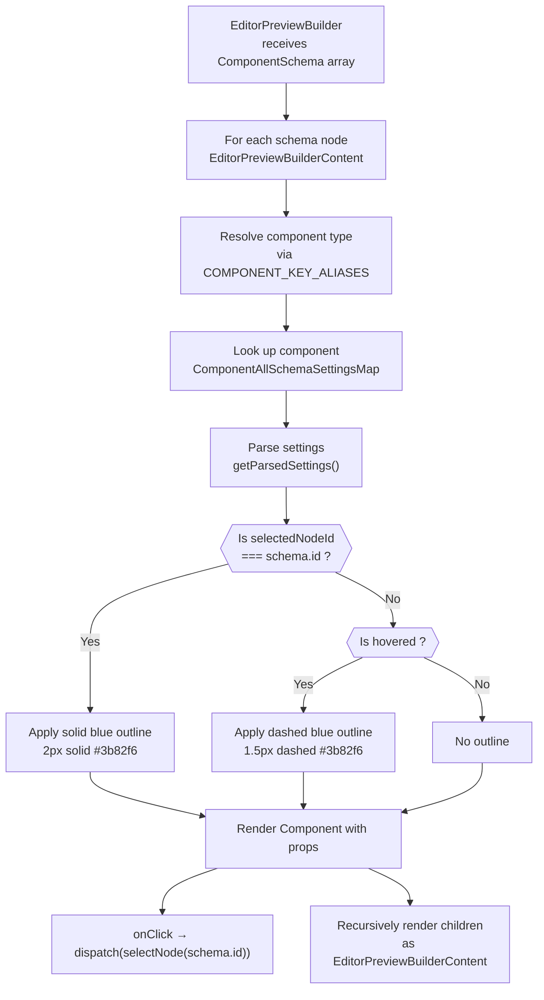
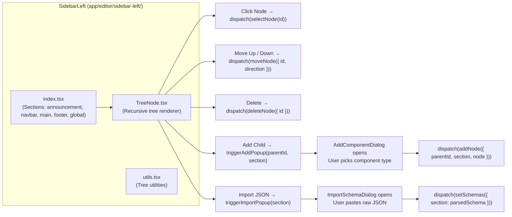
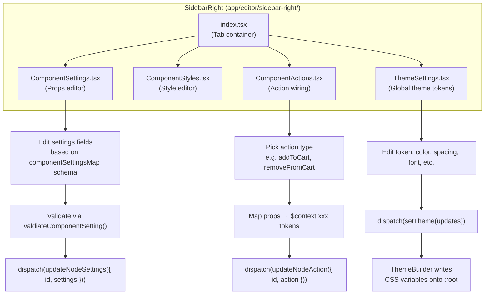
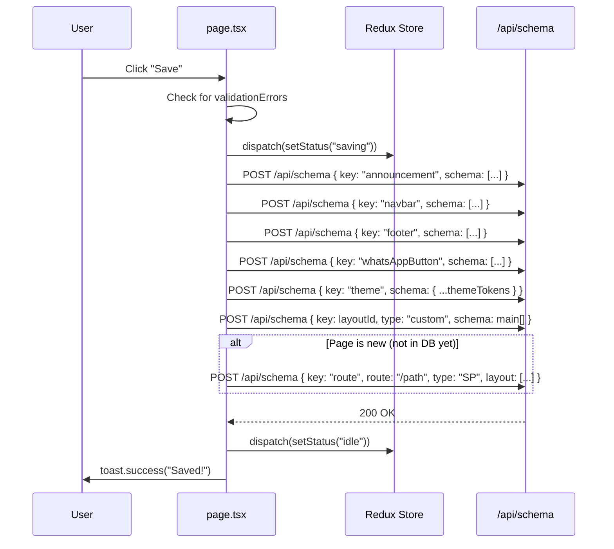
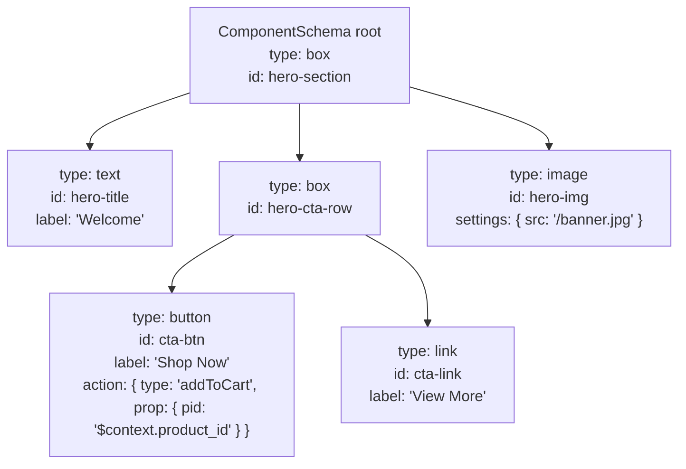
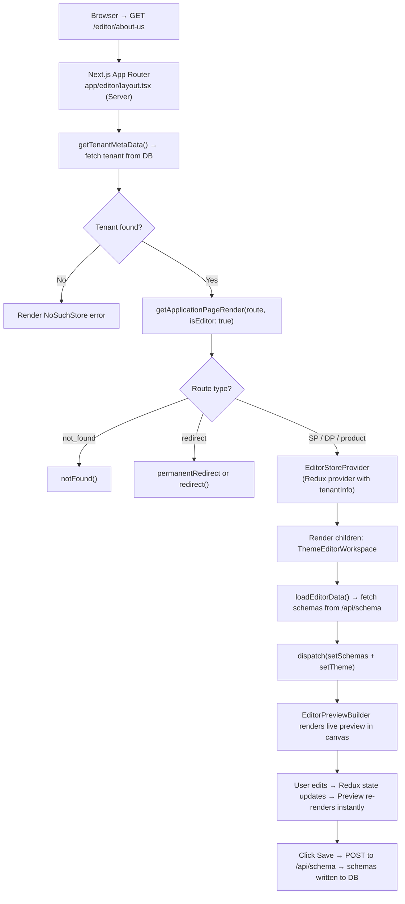

# Editor Architecture — Mermaid Diagrams

---

## 1. Overall Editor Layout Structure

---

## 2. Redux State Shape

```mermaid
graph LR
    subgraph EditorState["EditorState (bundles/store/editorSlice.ts)"]
        S1["schemas.announcement: ComponentSchema[]"]
        S2["schemas.navbar: ComponentSchema[]"]
        S3["schemas.main: ComponentSchema[]"]
        S4["schemas.footer: ComponentSchema[]"]
        S5["schemas.whatsAppButton: ComponentSchema[]"]
        S6["theme: ThemeConfig | null"]
        S7["selectedNodeId: string | null"]
        S8["activeSection: header | main | footer | global | null"]
        S9["status: idle | loading | saving | failed"]
        S10["tenantInfo: domain, slug, store, tenant"]
    end
```

---

## 3. Editor Data Loading Flow

---

## 4. CanvasViewport — Zoomable Canvas Interactions

---

## 5. EditorPreviewBuilder — Click-to-Select in Canvas

---

## 6. Left Sidebar — Component Tree Actions

---

## 7. Right Sidebar — Inspector Panel Tabs

---

## 8. Save Flow

---

## 9. ComponentSchema Tree Example

---

## 10. Full Editor Request Lifecycle

