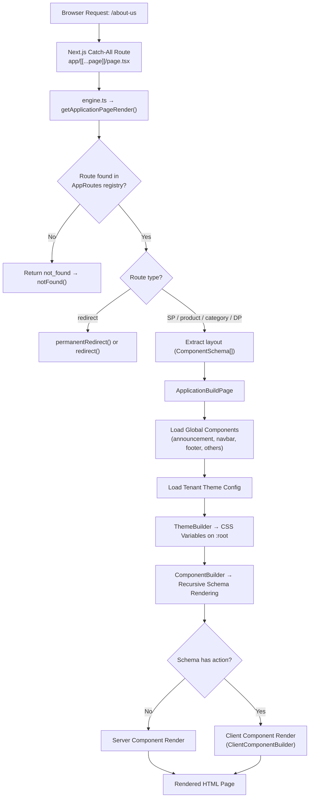
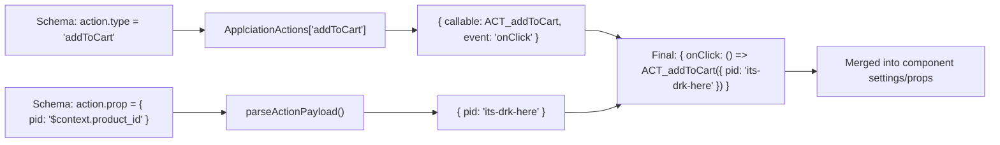

# Dhimora Storefront — System Architecture (Reverse-Engineered)

> **Project**: `banatechi` (a Dhimora client storefront)
> **Stack**: Next.js (App Router) + TypeScript + TailwindCSS
> **Core Idea**: A **schema-driven rendering engine** — no pages are hard-coded. Every page (and every global UI element) is described as a JSON-like `ComponentSchema` tree, which the runtime interprets into real React components at render time.

---

## 1. The Big Picture



---

## 2. Entry Point — The Catch-All Route

**File**: [page.tsx](file:///home/rohan/Projects/Dhimora/Clients/banatechi/app/[[...page]]/page.tsx)

Next.js optional catch-all `[[...page]]` captures **every** URL (`/`, `/about-us`, `/product/x`, etc.).

### Flow:
1. **Await params** — Next.js App Router requires `await` on `params` and `searchParams`.
2. **Build the route string** — joins the segments: `/(params.page || []).join("/")` → e.g. `/about-us`.
3. **Call `getApplicationPageRender()`** — the engine resolves the route to a layout + route config.
4. **Handle special types**:
   - `not_found` → calls Next.js `notFound()`.
   - `redirect` → calls `permanentRedirect()` (301) or `redirect()` (302).
5. **Render `ApplicationBuildPage`** — assembles the full page shell.

### Page Assembly Order:
```
<html>
  <body>
    <Application>              ← Session + Context providers
      <ThemeBuilder>           ← Injects CSS variables on :root
        <ComponentBuilder />   ← Announcement Bar
        <ComponentBuilder />   ← Navbar
        <ComponentBuilder />   ← Page Content (layout._c)
        <ComponentBuilder />   ← Footer
        <ComponentBuilder />   ← Other globals (e.g. WhatsApp button)
      </ThemeBuilder>
    </Application>
  </body>
</html>
```

> [!IMPORTANT]
> The `<html>` and `<body>` tags are rendered **inside** the page component, not the root `layout.tsx`. The root layout simply returns `{children}` — giving each page full control over the document.

---

## 3. The Routing Engine

**File**: [engine.ts](file:///home/rohan/Projects/Dhimora/Clients/banatechi/app/[[...page]]/engine.ts)

### `getApplicationPageRender({ route })`

1. Searches `AppRoutes` array for an exact match on `route`.
2. If no match → returns `{ type: "not_found" }`.
3. If match found and `layout` is an object (inline schema):
   - Extracts the layout into `pageLayout._c`.
   - Deletes `layout` from the route object (to avoid double-serialization).
   - Returns both `pageLayout` and `pageRoute`.

### `getAppGlobalComponent(componentID)`

Fetches global UI schemas from the `AppGlobalsComponents` registry:
- `"announcement"` → Announcement bar schema
- `"navbar"` → Navbar schema
- `"footer"` → Footer schema
- `"ALL_OTHERS"` → Everything **except** announcement, navbar, footer, and not_found (returns array)

### `getTenantThemeConfig()`

Returns the tenant's design tokens (colors, spacing, typography, shadows, etc.) — currently hardcoded, designed to be fetched per-tenant.

---

## 4. Route & Layout Registries

### Route Registry
**File**: [route.type.ts](file:///home/rohan/Projects/Dhimora/Clients/banatechi/application/runtime/pages/route.type.ts)

```typescript
export const AppRoutes: ApplicationRoutes[] = [APP_HOME_PAGE_ROUTE]
```

All routes live in this single array. The engine does a linear search `AppRoutes.find(_x => _x.route === route)`.

### Route Definition Example
**File**: [homepage.route.ts](file:///home/rohan/Projects/Dhimora/Clients/banatechi/application/runtime/pages/homepage.route.ts)

```typescript
export const APP_HOME_PAGE_ROUTE: ApplicationRoutes = {
    route: "/",           // URL path
    type: "SP",           // Single Page (rendered inline)
    layout: APP_HOME_PAGE_SCHEMA,  // The ComponentSchema tree
}
```

### Route Types ([type.ts](file:///home/rohan/Projects/Dhimora/Clients/banatechi/application/runtime/pages/type.ts))

| Type | Description | Layout |
|------|-------------|--------|
| `SP` | Single Page — static, self-contained | Inline `ComponentSchema[]` |
| `DP` | Dynamic Page — CMS-driven | Layout ID reference |
| `product` | Product detail page | Layout ID reference |
| `category` | Category listing page | Layout ID reference |
| `collection` | Collection page | Layout ID reference |
| `redirect` | HTTP redirect | No layout, uses `to`/`code` |
| `not_found` | 404 | No layout |

### Layout Registry
**File**: [layout.type.ts](file:///home/rohan/Projects/Dhimora/Clients/banatechi/application/runtime/pages/layout.type.ts)

```typescript
export const AppLayout: ApplicationLayout[] = [
    { id: "homepage", _c: APP_HOME_PAGE_SCHEMA }
]
```

> [!NOTE]
> For `SP` routes, the layout is embedded directly in the route. For `product`/`category`/`DP`/`collection` routes, the layout is referenced by ID and looked up from `AppLayout`. The engine currently only handles the inline-object case.

---

## 5. The ComponentSchema Specification

**File**: [type.ts](file:///home/rohan/Projects/Dhimora/Clients/banatechi/application/runtime/builder/type.ts)

```typescript
type ComponentSchema = {
    id: string                              // Unique identifier
    type: BaseTypes                         // Component type key
    settings?: Record<string, any>          // Props passed to the component
    action?: ComponentAction | ComponentAction[]  // Client-side event handlers
    label?: string | null                   // Text content
    children?: ComponentSchema[]            // Nested child schemas
}
```

This is the **universal unit** of the system. Everything — navbar, footer, a button, a page section — is a `ComponentSchema` node in a tree.

### Example: A button with an action

```typescript
{
    id: "asdfasdf",
    type: "button",
    label: "Add To Cart",
    action: {
        type: "addToCart",
        prop: { pid: "$context.product_id" }   // Dynamic value from runtime state
    }
}
```

### Example: A nested box with children

```typescript
{
    id: "navbar-shell",
    type: "box",
    settings: { className: "flex items-center gap-4" },
    children: [
        { id: "logo", type: "text", label: "Banatechi", settings: { as: "span", weight: "bold" } },
        { id: "search", type: "input", settings: { placeholder: "Search..." } }
    ]
}
```

---

## 6. The Builder Pipeline

### 6.1 ComponentBuilder (Server-Side)
**File**: [ComponentBuilder.tsx](file:///home/rohan/Projects/Dhimora/Clients/banatechi/application/runtime/builder/ComponentBuilder.tsx)

Entry point for all schema rendering. Handles both single schemas and arrays.

```
ComponentBuilder(schema)
  ├─ If schema is array → map each to ComponentBuilderContent
  └─ If schema is single → render ComponentBuilderContent
       ├─ Lookup component: AppComponents[schema.type]
       ├─ If schema has action → delegate to ClientComponentBuilder (client)
       └─ If no action → render server-side with props + recurse children
```

**Key decision**: If a schema node has an `action` property, it gets rendered as a **client component** (with `"use client"`). Otherwise it stays as a **server component** for better performance.

### 6.2 ClientComponentBuilder (Client-Side)
**File**: [ClientComponentBuilder.tsx](file:///home/rohan/Projects/Dhimora/Clients/banatechi/application/runtime/builder/ClientComponentBuilder.tsx)

Handles interactive components that need browser event handlers.

**Responsibilities**:
1. **Look up the component** from `AppComponents`.
2. **Resolve actions** via `returnComponentAction()`:
   - Maps `action.type` (e.g. `"addToCart"`) → finds the handler in `ApplciationActions`.
   - Maps `action.prop` values → resolves `$context.xxx` tokens against runtime state.
   - Returns an object like `{ onClick: () => handler(resolvedProps) }`.
3. **Merge action events into settings** — so the component receives `onClick` as a regular prop.
4. **Render** the component with all settings + label + children.

### 6.3 The `$context.` Token System

Schema payloads can reference runtime data using `$context.` prefix:

```typescript
{ pid: "$context.product_id" }
```

The `parseActionPayload()` function:
1. Detects values starting with `$context.`.
2. Strips the prefix and splits by `.` for nested access.
3. Resolves against the current runtime state object.

Currently, the runtime state is hardcoded: `{ product_id: "its-drk-here" }`. This is designed to be dynamic per-page context.

---

## 7. The Component Registry

**File**: [renders/index.ts](file:///home/rohan/Projects/Dhimora/Clients/banatechi/application/runtime/renders/index.ts)

```typescript
export const AppComponents: Record<BaseTypes, any> = {
    button: AButton,    box: ABox,       text: AText,
    image: AImage,      icon: AIcon,     input: AInput,
    link: ALink,        search_query: ASearchQuery
}
```

Available primitive types (`BaseTypes`): `button`, `box`, `icon`, `text`, `image`, `input`, `link`, `search_query`.

### Component Summary

| Type | File | Description | Server/Client |
|------|------|-------------|---------------|
| `button` | [Button.tsx](file:///home/rohan/Projects/Dhimora/Clients/banatechi/application/runtime/renders/Button.tsx) | Variants: primary/secondary/plain, sizes: sm/md/lg, loading state | Server |
| `box` | [Box.tsx](file:///home/rohan/Projects/Dhimora/Clients/banatechi/application/runtime/renders/Box.tsx) | Generic `<div>` wrapper with padding/background/border/radius tokens | Server |
| `text` | [Text.tsx](file:///home/rohan/Projects/Dhimora/Clients/banatechi/application/runtime/renders/Text.tsx) | Renders as p/h1-h6/span with size/weight variants | Server |
| `image` | [Image.tsx](file:///home/rohan/Projects/Dhimora/Clients/banatechi/application/runtime/renders/Image.tsx) | Native `` with aspect-ratio support | Server |
| `icon` | [Icon.tsx](file:///home/rohan/Projects/Dhimora/Clients/banatechi/application/runtime/renders/Icon.tsx) | Dynamic import from `lucide-react` by name | Server (async) |
| `input` | [Input.tsx](file:///home/rohan/Projects/Dhimora/Clients/banatechi/application/runtime/renders/Input.tsx) | Form input with label/error/size variants | Client |
| `link` | [Link.tsx](file:///home/rohan/Projects/Dhimora/Clients/banatechi/application/runtime/renders/Link.tsx) | Auto-detects internal (Next Link) vs external (`<a>`) | Server |
| `search_query` | [SearchQuery.tsx](file:///home/rohan/Projects/Dhimora/Clients/banatechi/application/runtime/renders/search/SearchQuery.tsx) | Input that navigates to `/search?query=` on Enter | Client |

> [!TIP]
> Every component accepts `label`/`content` as a text content fallback. The resolution order is: `children` → `content` → `label`. This lets schemas set text via `label` without needing children nodes.

---

## 8. The Action System

### Action Type Definition
**File**: [actions/type.ts](file:///home/rohan/Projects/Dhimora/Clients/banatechi/application/runtime/actions/type.ts)

```typescript
interface ComponentAction {
    type: ComponentActionTypes      // "addToCart" | "removeFromCart"
    prop: ComponentActionPayload    // { pid: "$context.product_id" }
}

interface ApplicationActionPayload {
    callable: Function              // The actual handler function
    event: ApplicationActionEvents  // "onClick" (only supported event currently)
}
```

### Action Registry
**File**: [actions/index.ts](file:///home/rohan/Projects/Dhimora/Clients/banatechi/application/runtime/actions/index.ts)

```typescript
export const ApplciationActions = {
    addToCart:      { callable: ACT_addToCart,      event: "onClick" },
    removeFromCart: { callable: ACT_removeFromCart,  event: "onClick" },
}
```

### Action Handlers
**File**: [actions/cart.ts](file:///home/rohan/Projects/Dhimora/Clients/banatechi/application/runtime/actions/cart.ts)

Currently stub implementations:
```typescript
export async function ACT_addToCart(params) {
    console.log("ADDED TO CART", params);
}
export async function ACT_removeFromCart() {}
```

### How Actions Wire Up (Full Flow):



---

## 9. Global Components System

**File**: [globals/index.ts](file:///home/rohan/Projects/Dhimora/Clients/banatechi/application/runtime/globals/index.ts)

```typescript
export const AppGlobalsComponents = {
    navbar:         Navbar,          // Full navbar schema tree
    footer:         Footer,          // Full footer schema tree
    announcement:   Announcement,    // Announcement bar schema
    not_found:      NotFound,        // 404 page content schema
    whatsAppButton: WhatsAppButton   // Floating WhatsApp button (WIP)
}
```

These are **not React components** — they are `ComponentSchema` objects. They're rendered through the same `ComponentBuilder` pipeline as everything else.

### Render Order in Page:
1. **Announcement** — top banner (shipping info)
2. **Navbar** — sticky navigation with brand, search, links, actions
3. **Page Content** — the route's layout schema (`layout._c`)
4. **Footer** — multi-column footer with links
5. **ALL_OTHERS** — everything in globals except announcement/navbar/footer/not_found

---

## 10. Theme System

**File**: [ThemeBuilder.tsx](file:///home/rohan/Projects/Dhimora/Clients/banatechi/application/runtime/builder/ThemeBuilder.tsx)

A client component that converts a `ThemeConfigs` object into CSS custom properties on `:root`.

### How it works:
1. Receives `themeConfigs` prop (from `getTenantThemeConfig()`).
2. Converts camelCase keys to CSS variable names: `brandPrimary` → `--brand-primary`.
3. Uses `useEffect` to set each variable via `document.documentElement.style.setProperty()`.

### Theme Token Categories:

| Category | Example Tokens |
|----------|---------------|
| Brand Identity | `primary`, `secondary`, `accent` |
| Semantic Colors | `colorSuccess`, `colorError`, `colorWarning`, `colorInfo` |
| Surfaces | `bgApp`, `bgSurface`, `bgNavigation` |
| Text | `textMain`, `textMuted`, `textInverted` |
| Buttons | `btnRadius`, `btnPaddingBase`, `btnHoverOpacity` |
| Layout | `spacingUnit`, `containerMaxWidth`, `gridGutter` |
| Borders/Elevation | `borderPrimary`, `borderRadiusBase`, `shadowSoft`, `shadowHard` |
| Typography | `fontFamilySans`, `fontFamilyMono`, `fontSizeRoot`, `lineHeightBase` |

> [!NOTE]
> Currently `getTenantThemeConfig()` returns hardcoded values. The function signature accepts `{ tenantID, storeID }`, indicating it's designed to fetch tenant-specific themes from an API.

---

## 11. Application Provider Layer

**File**: [Application.tsx](file:///home/rohan/Projects/Dhimora/Clients/banatechi/application/providers/wrappers/Application.tsx)

Wraps the entire app in:
1. **`SessionProvider`** (next-auth) — handles authentication state, polls every 300s.
2. **`ApplicationContext`** — React context (currently empty, designed for app state like `auth`, `data`, `toast`).
3. **`ApplicationInit`** — shows a splash screen during session loading, adds `beforeunload` listener when `window.onButtonEvent` is truthy.

### App Config
**File**: [app/index.ts](file:///home/rohan/Projects/Dhimora/Clients/banatechi/app/index.ts)

Defines tenant/store IDs, API slugs, and route constants. Environment-aware:
- **Production**: uses Dhimora cloud tenant/store IDs + `https://apis.dhimora.com`
- **Development**: uses local tenant/store IDs + `http://localhost:2000`

---

## 12. Complete File Map

```
banatechi/
├── app/
│   ├── [[...page]]/              ← CATCH-ALL ROUTE (the entire storefront)
│   │   ├── page.tsx              ← Entry point: resolves route → renders page
│   │   ├── engine.ts             ← Route resolution + global component fetching
│   │   └── types.ts              ← ApplicationIndexParams type
│   ├── editor/[[...route]]/      ← Visual editor (placeholder)
│   │   └── page.tsx
│   ├── api/                      ← API routes
│   ├── run-category/             ← Category-specific routes
│   ├── run-product/              ← Product-specific routes
│   ├── layout.tsx                ← Root layout (minimal, just returns children)
│   ├── not-found.tsx             ← Next.js 404 (uses ComponentBuilder + NotFound schema)
│   ├── loading.tsx               ← Next.js loading state
│   ├── globals.css               ← TailwindCSS + CSS variables + dark theme
│   ├── index.ts                  ← App constants (tenant, store, API slug)
│   └── global.d.ts               ← Global type declarations
│
├── application/
│   ├── runtime/
│   │   ├── builder/              ← THE RENDERING ENGINE
│   │   │   ├── ComponentBuilder.tsx      ← Server-side schema renderer
│   │   │   ├── ClientComponentBuilder.tsx ← Client-side schema renderer (for actions)
│   │   │   ├── ThemeBuilder.tsx          ← CSS variable injection
│   │   │   ├── ErrorBoundary.tsx         ← React error boundary
│   │   │   └── type.ts                  ← ComponentSchema type definition
│   │   ├── renders/              ← COMPONENT REGISTRY (primitives)
│   │   │   ├── index.ts          ← AppComponents map
│   │   │   ├── type.ts           ← BaseTypes + BaseProps
│   │   │   ├── Button.tsx, Box.tsx, Text.tsx, Image.tsx
│   │   │   ├── Icon.tsx, Input.tsx, Link.tsx
│   │   │   └── search/SearchQuery.tsx
│   │   ├── actions/              ← ACTION SYSTEM
│   │   │   ├── index.ts          ← ApplciationActions registry
│   │   │   ├── type.ts           ← ComponentAction types
│   │   │   ├── cart.ts           ← addToCart / removeFromCart handlers
│   │   │   └── search.ts        ← (empty)
│   │   ├── pages/                ← ROUTE & LAYOUT DEFINITIONS
│   │   │   ├── type.ts           ← ApplicationRoutes, ApplicationLayout types
│   │   │   ├── route.type.ts     ← AppRoutes[] registry
│   │   │   ├── layout.type.ts    ← AppLayout[] registry
│   │   │   ├── homepage.route.ts ← Homepage route definition
│   │   │   └── homepage.layout.ts ← Homepage layout schema
│   │   └── globals/              ← GLOBAL UI SCHEMAS
│   │       ├── index.ts          ← AppGlobalsComponents registry
│   │       ├── Navbar.tsx, Footer.tsx, Announcement.tsx
│   │       ├── NotFound.tsx, WhatsAppButton.tsx
│   │
│   ├── providers/
│   │   ├── wrappers/             ← App-level providers
│   │   │   ├── Application.tsx   ← SessionProvider + ApplicationContext
│   │   │   ├── ApplicationInit.tsx ← Splash screen + beforeunload
│   │   │   └── type.ts           ← Context value types
│   │   ├── api/                  ← API client utilities
│   │   ├── sp/                   ← Server-side providers
│   │   └── option/               ← Configuration providers
│   │
│   ├── components/               ← Shared UI components (PoweredByDhimora)
│   ├── modules/                  ← Feature modules (auth, category, product, schema)
│   ├── widgets/                  ← UI widgets (button, container, loader, model, splash_screen, toast)
│   ├── json-ld/                  ← Structured data (SEO)
│   └── utility/                  ← Shared utilities
```

---

## 13. How to Add a New Page

1. **Create the layout** in `application/runtime/pages/`:
```typescript
// mypage.layout.ts
export const MY_PAGE_SCHEMA: ComponentSchema[] = [
    { id: "hero", type: "box", children: [...] }
]
```

2. **Create the route** in `application/runtime/pages/`:
```typescript
// mypage.route.ts
export const MY_PAGE_ROUTE: ApplicationRoutes = {
    route: "/my-page",
    type: "SP",
    layout: MY_PAGE_SCHEMA,
}
```

3. **Register in AppRoutes** in `route.type.ts`:
```typescript
export const AppRoutes: ApplicationRoutes[] = [APP_HOME_PAGE_ROUTE, MY_PAGE_ROUTE]
```

---

## 14. How to Add a New Component Primitive

1. **Create the component** in `application/runtime/renders/`:
```typescript
// Video.tsx
export default function AVideo({ src, ...props }) {
    return <video src={src} {...props} />
}
```

2. **Add to BaseTypes** in `renders/type.ts`:
```typescript
export type BaseTypes = "button" | "box" | ... | "video"
```

3. **Register in AppComponents** in `renders/index.ts`:
```typescript
import AVideo from './Video';
export const AppComponents = { ..., video: AVideo }
```

---

## 15. How to Add a New Action

1. **Create the handler** in `application/runtime/actions/`:
```typescript
// wishlist.ts
export async function ACT_addToWishlist(params) { ... }
```

2. **Add to ComponentActionTypes** in `actions/type.ts`:
```typescript
export type ComponentActionTypes = "addToCart" | "removeFromCart" | "addToWishlist"
```

3. **Register in ApplciationActions** in `actions/index.ts`:
```typescript
addToWishlist: { callable: ACT_addToWishlist, event: "onClick" }
```

---

## 16. Key Design Decisions & Trade-offs

| Decision | Rationale | Trade-off |
|----------|-----------|-----------|
| Schema-driven rendering | Entire UI is data — can be stored in DB, edited visually, swapped per tenant | Adds complexity; harder to debug than direct JSX |
| Server/Client split on `action` | Components without actions stay server-rendered (fast); interactive ones hydrate client-side | All action components and their children become client bundles |
| Linear route search | Simple; works for small route sets | O(n) lookup; no parameterized routes (`/product/:id`) yet |
| Inline layouts in routes | For `SP` pages, no indirection — route = layout | Couples routing to layout; layout reuse requires separate `AppLayout` registry |
| Hardcoded globals | Navbar/Footer defined as code-level schemas | Can't be edited via CMS yet; changing requires a deploy |
| `$context.` token system | Schemas can reference runtime data without knowing the source | Currently hardcoded; needs integration with real product/page context |

> [!WARNING]
> The system has some incomplete areas:
> - `WhatsAppButton` schema is a stub (empty child object).
> - `SearchQuery` uses `.strip()` (Python syntax, not JS — should be `.trim()`).
> - The editor (`/editor/[[...route]]`) is a placeholder.
> - `$context` runtime state is hardcoded to `{ product_id: "its-drk-here" }`.
> - `ApplicationContext` value is currently empty `{}`.
